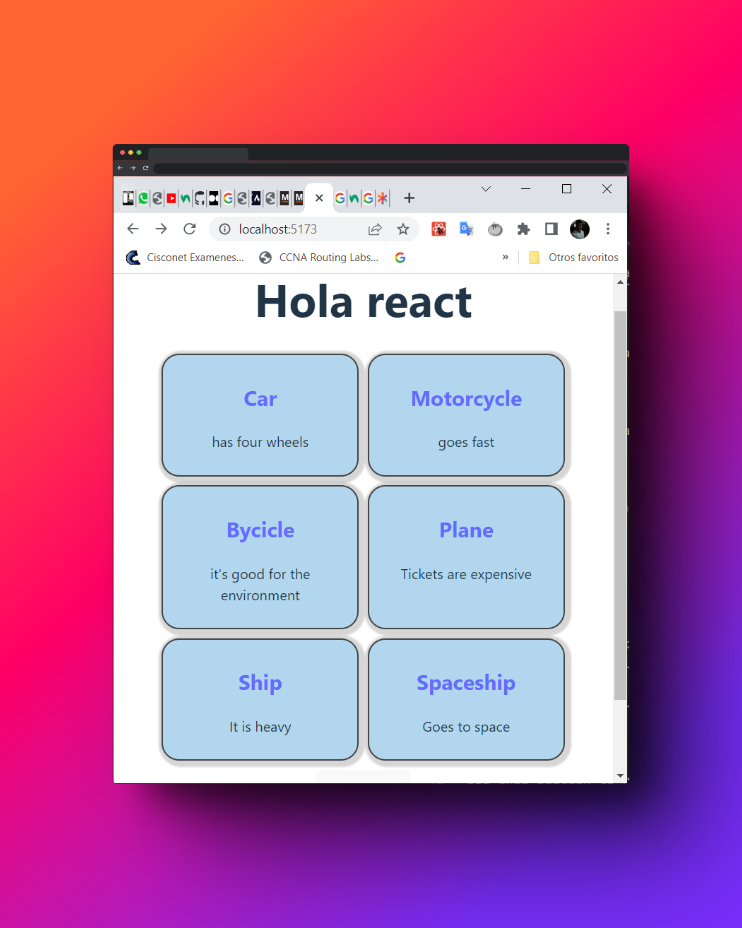

# Make It Real - react en 45 minutos

Esto es una solucion de un ejemplo practico de las funciones basicas que se pueden desarrollar con react

## Table of contents

- [Overview](#overview)
  - [The challenge](#the-challenge)
  - [Screenshot](#screenshot)
- [My process](#my-process)
  - [Built with](#built-with)
  - [What I learned](#what-i-learned)
  - [Continued development](#continued-development)
  - [Useful resources](#useful-resources)
- [Author](#author)
- [Acknowledgments](#acknowledgments)

## Overview

- esto es un programa para practicar react donde se uso el estado y se usaron rutas

### The challenge

crear componentes, hacer uso de estado y de rutas de react

### Screenshot

## My process

### Built with

- Semantic HTML5 markup
- CSS custom properties
- Flexbox

### What I learned

Use this section to recap over some of your major learnings while working through this project. Writing these out and providing code samples of areas you want to highlight is a great way to reinforce your own knowledge.

### Continued development

Use this section to outline areas that you want to continue focusing on in future projects. These could be concepts you're still not completely comfortable with or techniques you found useful that you want to refine and perfect.

## Author

- linkedin - [Welinton Suarez](https://www.linkedin.com/in/welinton-suarez-galvis-4a348655/)
- github - [@wesgdev1](https://github.com/wesgdev1)

## Acknowledgments

This is where you can give a hat tip to anyone who helped you out on this project. Perhaps you worked in a team or got some inspiration from someone else's solution. This is the perfect place to give them some credit.
